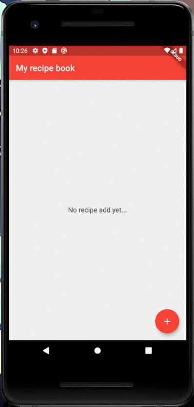

# recipe_book_app

A new recipe book Flutter project, architected with clean architecture and state managed with MobX.

## Bases:

- Idea inpsired by [Recipe-App](https://github.com/florinpop17/app-ideas/blob/master/Projects/1-Beginner/Recipe-App.md);
- architecture inpsired, based and learned from [Resocoder Flutter TDD Clean Architecture Course](https://github.com/ResoCoder/flutter-tdd-clean-architecture-course) (TDD stays to another project 😜).

## Demo

# Devs

## day to day commands

### generate or re-generate stores files (\*.g.dart)

`dart run build_runner build`

### generate or re-generate localizations files from json files (assests/lang/[locale].json)

`flutter pub run easy_localization:generate --source-dir=assets/lang --output-dir=lib/core/localization_generated`

`flutter pub run easy_localization:generate --source-dir=assets/lang --output-dir=lib/core/localization_generated -f keys -o locale_keys.g.dart`

### generate release .aab (application app bundle)

`flutter build appbundle`

### generate release apk

`flutter build apk`

#### installing the generated apk

`flutter install`
