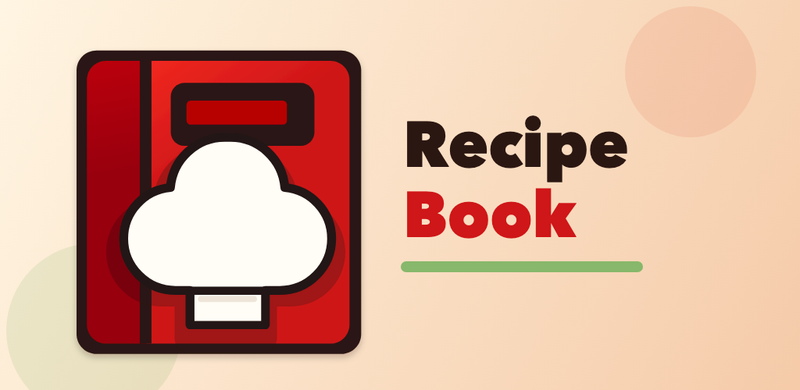

<p align="center">
  
</p>

<p align="center">
  A recipe book app built with Flutter, following Clean Architecture and MobX for state management.
</p>

---

## Screenshots

<p align="center">
  
  
  
  
</p>

<p align="center">
  
</p>

## Features

- Create, edit and delete recipes
- Add ingredients and preparation steps
- Categorize recipes by type (meal, snack, dessert, drink, etc.)
- Set difficulty level and number of servings
- Reorder ingredients and steps via drag & drop
- Localization support (English and Portuguese)
- Local database with Sembast

## Architecture

The project follows **Clean Architecture** with three layers:

```
lib/
  core/           # Shared utilities, services, localization
  features/
    recipe/
      data/       # Data sources, models, repository impl
      domain/     # Entities, repository contracts, use cases
      presentation/ # Pages, stores (MobX), widgets
```

Inspired by [Resocoder's Flutter TDD Clean Architecture Course](https://github.com/ResoCoder/flutter-tdd-clean-architecture-course).

## Tech Stack

| Category | Library |
|----------|---------|
| State management | [MobX](https://pub.dev/packages/mobx) + [flutter_mobx](https://pub.dev/packages/flutter_mobx) |
| Dependency injection | [get_it](https://pub.dev/packages/get_it) |
| Local database | [Sembast](https://pub.dev/packages/sembast) |
| Localization | [easy_localization](https://pub.dev/packages/easy_localization) |
| Icons | [font_awesome_flutter](https://pub.dev/packages/font_awesome_flutter) |
| Code generation | [build_runner](https://pub.dev/packages/build_runner) + [mobx_codegen](https://pub.dev/packages/mobx_codegen) |

## Requirements

- Flutter 3.44+ / Dart 3.12+

## Getting Started

```bash
# Install dependencies
flutter pub get

# Run the app
flutter run
```

## Dev Commands

### Generate / regenerate MobX store files (`*.g.dart`)

```bash
dart run build_runner build
```

### Generate / regenerate localization files

```bash
# Generate loader
flutter pub run easy_localization:generate \
  --source-dir=assets/lang \
  --output-dir=lib/core/localization_generated

# Generate keys
flutter pub run easy_localization:generate \
  --source-dir=assets/lang \
  --output-dir=lib/core/localization_generated \
  -f keys -o locale_keys.g.dart
```

### Build release

```bash
# Android App Bundle
flutter build appbundle

# APK
flutter build apk

# Install on connected device
flutter install
```

## Credits

- Idea inspired by [Recipe-App](https://github.com/florinpop17/app-ideas/blob/master/Projects/1-Beginner/Recipe-App.md) from [App Ideas Collection](https://github.com/florinpop17/app-ideas)
